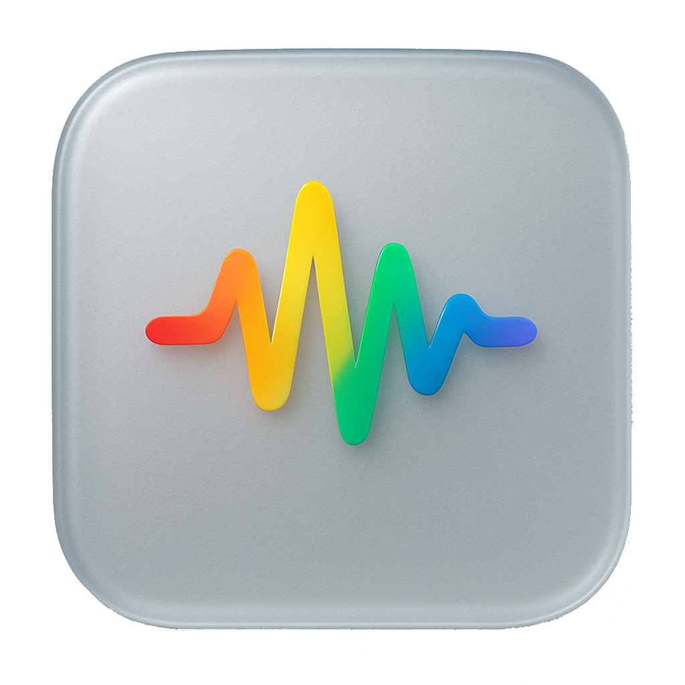

<p align="center">
  
</p>

<h1 align="center">Studio Pipeline</h1>

<p align="center">
  <strong>Automated video processing, audio enhancement, and AI-powered analytics for studio recordings.</strong>
</p>

---

## Overview

**Studio Pipeline** is a turnkey macOS application that automates the complete lifecycle of studio video recordings — from discovery on an ATEM Mini's FTP server through audio enhancement, intelligent file organization, and optional AI-driven content analytics. It ships as a single `.app` bundle with a built-in React dashboard and video kiosk.

### Why?

Recording studios produce dozens of raw video files per session across multiple camera angles. Manually downloading, processing audio, organizing by date, and cataloguing content is tedious and error-prone. Studio Pipeline eliminates that entire workflow — plug in the ATEM, press record, and everything else happens automatically.

---

## Features

| | Feature | Description |
|---|---|---|
| 🔍 | **Auto-Discovery** | Continuously scans ATEM Mini FTP for new recordings and groups multi-camera sessions |
| 📥 | **FTP Download** | Reliable file transfer with speed tracking, progress bars, and automatic retry |
| 🎧 | **Audio Enhancement** | ONNX neural-net denoising + volume normalization via Swift audio tools |
| ✂️ | **Gesture Trim** | MediaPipe detects "stop recording" fist gesture and losslessly trims the ending |
| 📂 | **Smart Organization** | Date-based folder hierarchy with program/ISO/MP3 separation |
| 🖥️ | **Video Kiosk** | Full-screen playback with waveform scrubbing and thumbnail browser |
| 🤖 | **AI Transcription** | MLX Whisper (Apple Silicon optimized) speech-to-text |
| 📊 | **AI Analytics** | Qwen Vision-Language Model extracts titles, speakers, audience, content type |
| 📈 | **Excel Export** | Schema-compliant XLSX for Power Automate integration |
| 🔄 | **Live Dashboard** | Real-time WebSocket updates for all pipeline stages and worker status |
| 🛡️ | **Auto-Recovery** | Classified failure categories with intelligent retry and exponential backoff |

---

## Pipeline Steps

The pipeline processes each recording through a series of automated stages:

```
 DISCOVER ──▶ COPY ──▶ PROCESS ──▶ ORGANIZE ──▶ COMPLETE
   (FTP)     (Download)  (Audio)    (File tree)    (Upload to Sharepoint)
                           │
                           ├── Extract audio
                           ├── Analyse and adjust volume to correct levels
                           ├── Enhance voice/remove Noise
                           ├── Remux enhanced audio back into .mp4
                           └── Detect and trim 'stop' hand gesture
```

<!-- GIF: Pipeline Steps -->
<p align="center">
  
  <br/>
  <em>Pipeline processing a multi-camera session through all stages with real-time progress</em>
</p>

---

## Before / After

Audio enhancement uses a neural-network denoiser (ONNX Runtime) combined with Swift-based volume boosting to dramatically improve recording quality — removing HVAC hum, electrical noise, and normalizing levels.

<!-- GIF: Before/After Video -->
<p align="center">
  
  <br/>
  <em>Side-by-side comparison: raw recording vs. enhanced audio output</em>
</p>

---

## Kiosk Playback

The built-in video kiosk provides a polished playback experience for reviewing processed recordings directly from the app — no need for external players.

- **Video.js** player with byte-range streaming
- **Waveform visualization** with click-to-seek
- **Thumbnail sidebar** to browse all completed recordings
- Fullscreen optimized

<!-- GIF: Kiosk Playback -->
<p align="center">
  
  <br/>
  <em>Kiosk view with waveform scrubbing and thumbnail navigation</em>
</p>

---

## AI Analytics

When built with AI features enabled, Studio Pipeline uses on-device Apple Silicon ML models to transcribe and analyze every recording — no cloud services required.

| Model | Purpose | Framework |
|-------|---------|-----------|
| **MLX Whisper** | Speech-to-text transcription | MLX (Apple Silicon) |
| **Qwen3-VL** | Vision-language content analysis | MLX-VLM |

Extracted metadata includes:
- **Title & Description** generated from content
- **Content Type** — Promotional, Learning, Tutorial, Lecture, etc.
- **Faculty** classification
- **Audience** — Student, Staff, Parent, Prospective
- **Speaker** detection with confidence
- **Language** detection

All analytics export to a schema-compliant Excel spreadsheet for Power Automate workflows.

<!-- GIF: AI Analytics -->
<p align="center">
  
  <br/>
  <em>AI-generated metadata with transcription, content classification, and Excel export</em>
</p>

---

## Architecture

```
┌─────────────────────────────────────────────────────────────────────┐
│                        StudioPipeline.app                          │
│                                                                     │
│  ┌──────────────────────────┐   ┌────────────────────────────────┐  │
│  │    React Frontend        │   │       FastAPI Backend          │  │
│  │                          │   │                                │  │
│  │  ┌────────────────────┐  │   │  ┌──────────┐  ┌───────────┐  │  │
│  │  │  Pipeline View     │  │◀─▶│  │ Workers  │  │ Services  │  │  │
│  │  │  Kiosk View        │  │ws │  │          │  │           │  │  │
│  │  │  Analytics View    │  │   │  │  Copy    │  │ Discovery │  │  │
│  │  │  Settings          │  │   │  │  Process │  │ Recovery  │  │  │
│  │  └────────────────────┘  │   │  │  Organize│  │ Integrity │  │  │
│  │                          │   │  │  Thumb   │  │ WebSocket │  │  │
│  └──────────────────────────┘   │  │  AI ×2   │  │ AI Mutex  │  │  │
│                                  │  └──────────┘  └───────────┘  │  │
│                                  │         │                     │  │
│                                  │    ┌────▼─────┐               │  │
│                                  │    │ SQLite   │               │  │
│                                  │    │ Database │               │  │
│                                  │    └──────────┘               │  │
│                                  └────────────────────────────────┘  │
│                                                                     │
│  ┌──────────────┐  ┌──────────────┐  ┌───────────────────────────┐  │
│  │ Swift Tools  │  │ ONNX Model   │  │  MLX Models (AI build)   │  │
│  │ (Audio)      │  │ (Denoiser)   │  │  Whisper + Qwen3-VL      │  │
│  └──────────────┘  └──────────────┘  └───────────────────────────┘  │
└─────────────────────────────────────────────────────────────────────┘
         │                                        │
         ▼                                        ▼
   ┌───────────┐                          ┌──────────────┐
   │ ATEM Mini │                          │ Output Drive │
   │ FTP Server│                          │ (Organized)  │
   └───────────┘                          └──────────────┘
```

---

## Tech Stack

| Layer | Technology |
|-------|-----------|
| **Frontend** | React 18, Vite, TailwindCSS, Video.js, TanStack Query |
| **Backend** | Python 3.11+, FastAPI, SQLAlchemy, asyncio |
| **Audio** | Swift AVFoundation tools, ONNX Runtime denoiser |
| **Vision** | MediaPipe (gesture detection), OpenCV |
| **AI** | MLX Whisper, MLX-VLM (Qwen3-VL), Hugging Face Transformers |
| **Transport** | WebSockets (real-time), REST API, FTP (aioftp) |
| **Packaging** | PyInstaller, macOS .app bundle, DMG installer |

---

## Getting Started

### Prerequisites

- **macOS 14+** on Apple Silicon (M1/M2/M3/M4)
- **Python 3.11+**
- **Node.js 20+**
- **FFmpeg** (bundled or available on PATH)

### Installation

```bash
# Clone the repository
git clone <repo-url> && cd Unified-Studio

# Create Python virtual environment
python3 -m venv .venv && source .venv/bin/activate

# Install dependencies
pip install -r requirements.txt        # Standard build
pip install -r requirements-ai.txt     # AI build (includes MLX models)

# Install frontend
cd frontend && npm install && cd ..
```

### Development

```bash
# Start both servers (backend + frontend dev)
./start_servers.sh

# Or start individually
make dev            # Backend on :8000
make dev-frontend   # Frontend on :5173
```

### Build

```bash
# Build complete .app bundle + DMG
./build.sh

# Or step by step
make frontend       # Build React app
make backend        # Bundle with PyInstaller
make all            # Assemble .app
make dmg            # Create DMG installer
```

### AI Build

```bash
# Build with AI features (transcription + analytics)
BUILD_WITH_AI=true ./build.sh

# Or use the AI-specific scripts
./build_ai.sh
./start_servers_ai.sh
```

---

## Output Structure

Processed recordings are automatically organized into a clean date-based hierarchy:

```
Output Drive/
└── 2025/
    └── 11 - November/
        └── 11 Tue November/
            ├── Morning Assembly.mp4
            ├── Staff Briefing.mp4
            └── Source Files/
                └── Morning Assembly/
                    ├── CAM 1 01.mp4
                    ├── CAM 2 01.mp4
                    └── Morning Assembly.mp3
```

---

## Configuration

All settings are managed through the in-app Settings dialog or the dev queue:

| Setting | Description | Default |
|---------|-------------|---------|
| FTP Host | ATEM Mini IP address | `localhost` |
| FTP Port | FTP server port | `21` |
| Temp Path | Working directory for processing | `/tmp/pipeline` |
| Output Path | Final organized output directory | `~/Videos/StudioPipeline` |
| Pause Processing | Pause audio/organize workers | `false` |
| ISO Min Size | Minimum size for ISO file processing | `50 MB` |

---

## Failure Recovery

The pipeline classifies failures and automatically recovers where possible:

| Category | Example | Recovery |
|----------|---------|----------|
| **FTP Connection** | Server unreachable | Auto-retry when FTP reconnects |
| **FTP Transfer** | Download interrupted | Resume on reconnection |
| **Processing** | Audio tool error | Exponential backoff retry |
| **Storage** | Disk full, path missing | Retry when resolved |
| **Corrupt File** | Invalid video data | Marked unrecoverable |

Failed files are retried up to 10 times with exponential backoff, only after all healthy files have finished processing.

---

## Project Structure

```
Unified-Studio/
├── backend/
│   ├── main.py                 # FastAPI entry point
│   ├── models.py               # SQLAlchemy models
│   ├── workers/                # Pipeline workers (copy, process, organize, AI)
│   ├── services/               # Business logic (discovery, recovery, WebSocket)
│   ├── api/                    # REST endpoints
│   └── config/                 # AI configuration
├── frontend/
│   └── src/
│       ├── views/              # PipelineView, KioskView, AnalyticsView
│       ├── components/         # UI components + kiosk player
│       └── hooks/              # WebSocket & data hooks
├── swift_tools/                # Native macOS audio processing
├── models/                     # ONNX denoiser + MLX AI models
├── packaging/                  # App bundle assembly & signing
├── build.sh                    # Full build script
├── start_servers.sh            # Development server launcher
└── Makefile                    # Dev shortcuts
```

---

<p align="center">
  Built for <strong>Apple Silicon</strong> — processing video the way it should be.
</p>
